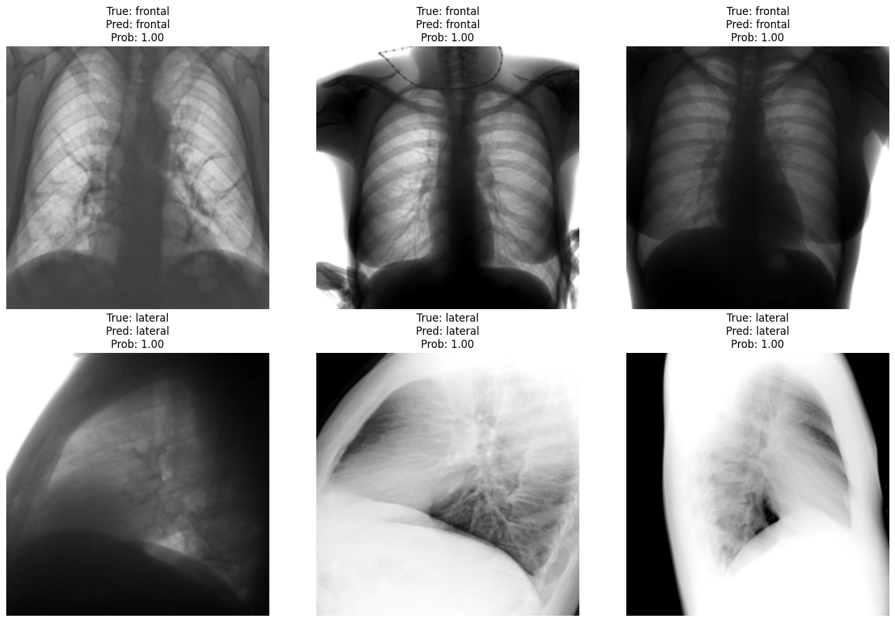

# 🩻 Классификация рентгеновских снимков

---

## 🎯 **Задача**

> Разработать и обучить классификатор, эффективно определяющий тип рентгенографических снимков (РГ) по следующим категориям:

- 🔷 **FRONTAL** — фронтальная проекция  
- 🔷 **LATERAL** — боковая проекция  
- 🔷 **TRASH** — изображения, содержащие иные проекции и/или другие органы  

  

---

## 📁 **Условия**

Для решения задачи предоставлены два набора данных:

- 📂 **Train** — тренировочный датасет  
- 📂 **Validation** — валидационный датасет

---

## 📊 **Состав тренировочного датасета** (`Train`)

- 🖼️ Всего: **4188** PNG изображений  
- 🔹 **FRONTAL**: 1399 снимков фронтальной проекции  
- 🔹 **LATERAL**: 1399 снимков боковой проекции  
- 🔹 **TRASH**: 1389 снимков с иными проекциями или другими органами  

> 🧠 *Тренировочный датасет используется исключительно для обучения модели.*

---

## 📊 **Состав валидационного датасета** (`Validation`)

- 🖼️ Всего: **1000** PNG изображений  
- 🔸 **FRONTAL**: 330 снимков фронтальной проекции  
- 🔸 **LATERAL**: 329 снимков боковой проекции  
- 🔸 **TRASH**: 340 снимков с иными проекциями или другими органами  

> 🧪 *Валидационный датасет предназначен для открытой проверки модели и не участвует в обучении.*

---
